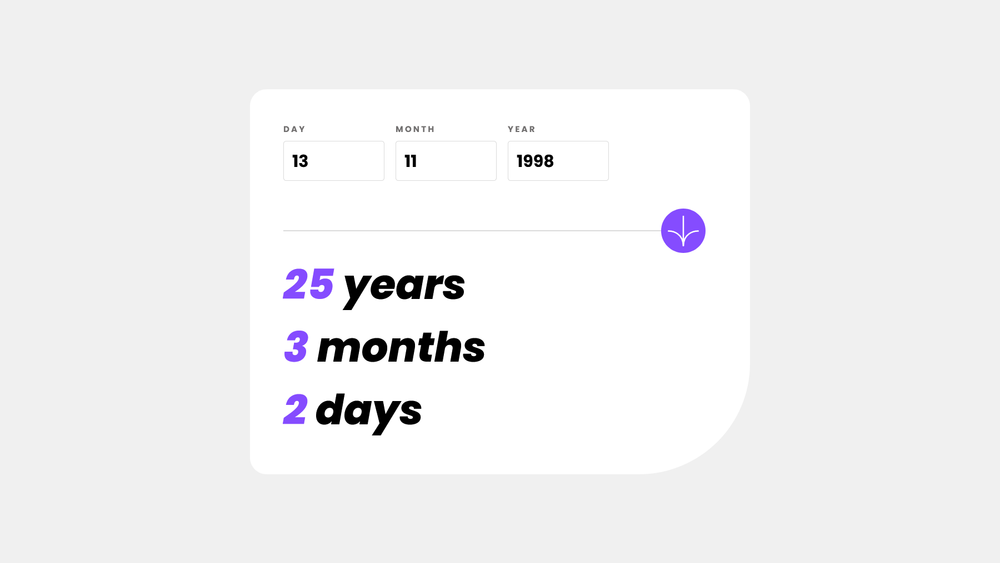
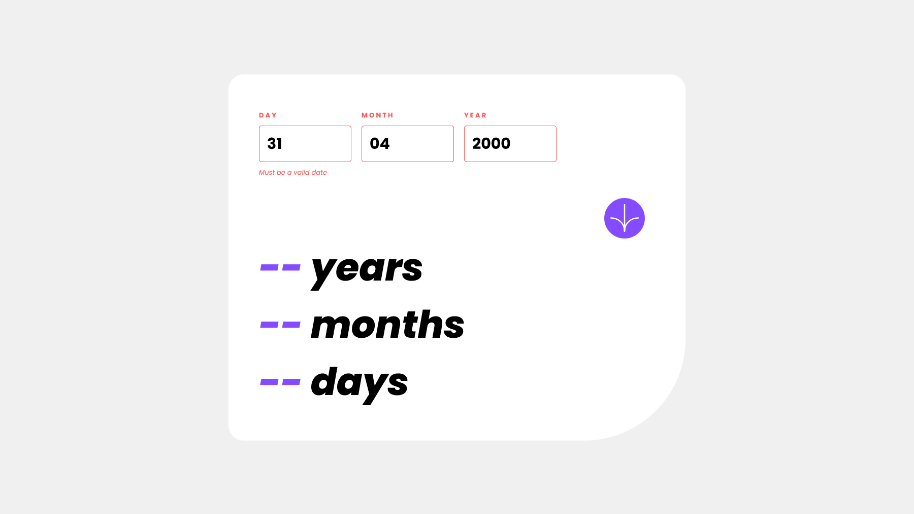
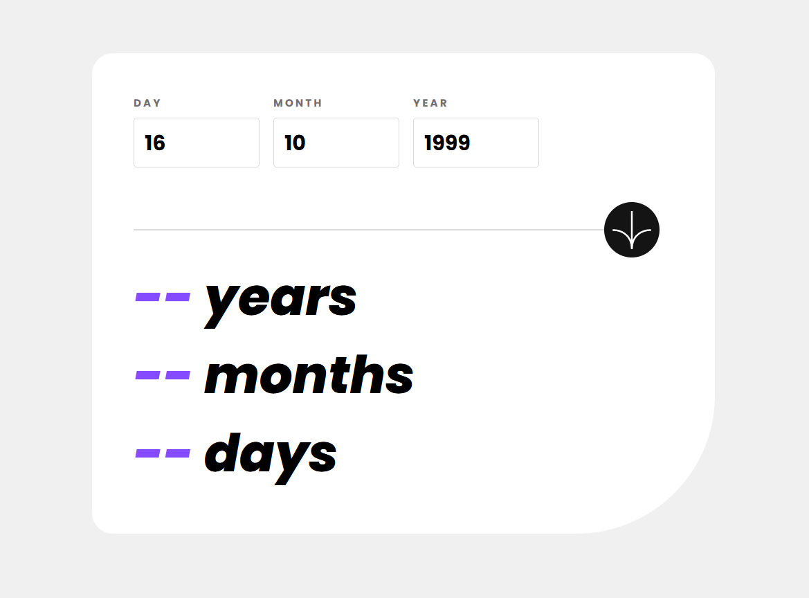

# Frontend Mentor - Age Calculator App


## Welcome! 👋

# Frontend Mentor - Age Calculator App Solution

This is a solution to the [Age calculator app challenge on Frontend Mentor](https://www.frontendmentor.io/challenges/age-calculator-app-dF9DFFpj-Q). Frontend Mentor challenges help you improve your coding skills by building realistic projects.

## Table of contents

- [Overview](#overview)
  - [The challenge](#the-challenge)
  - [Screenshot](#screenshot)
  - [Links](#links)
- [My process](#my-process)
  - [Built with](#built-with)
  - [What I learned](#what-i-learned)
  - [Useful resources](#useful-resources)
- [Author](#author)

## Overview

### The challenge

Users should be able to:

- View an age in years, months, and days after submitting a valid date through the form
- Receive validation errors if:
  - Any field is empty when the form is submitted
  - The day number is not between 1-31
  - The month number is not between 1-12
  - The year is in the future
  - The date is invalid e.g. 31/04/1991 (there are 30 days in April)
- View the optimal layout for the interface depending on their device's screen size
- See hover and focus states for all interactive elements on the page
- **Bonus**: See the age numbers animate to their final number when the form is submitted

### Screenshot

## Mobile Preview


## Desktop Preview



## Empty Form Preview


## Invalid Form Preview



## Active State Preview



### Links

- Solution URL: https://github.com/DwarakanathAkkala/AgeCalculatorApp
- Live Site URL: https://age-calculator-front-end-mentor.netlify.app/

## My process

### Built with

- Semantic HTML5 markup
- CSS custom properties
- Flexbox
- CSS Grid
- Mobile-first workflow

### What I learned

```html
<!-- Do not autofill the number input using "autocomplete" attribute -->

<input
  autocomplete="off"
  type="number"
  class="poppins-bold"
  id="day"
  name="day"
  placeholder="DD"
/>
```

```css
/* Targeting the input elements with a specific keyword used in "class" attribute */

input[class~="error"] {
  border-color: var(--light-red);
  outline: none;
}
```

```js
// Animate the age numbers to their final number when the form is submitted

function animateResult(result, value, animateInterval) {
  clearInterval(animateInterval);

  let count = 0;

  let idInterval = setInterval(function () {
    let output = document.getElementById(result);
    output.innerText = count;
    count++;
    if (count > value) {
      clearInterval(idInterval);
    }
  }, 40);
}
```

### Useful resources

- Stack Overflow (https://stackoverflow.com/) - This helped me for manipulating DOM by targeting HTML elements using JS with optimised code.

## Author

- Website - [Dwarakanath](https://dwarakanath-akkala.netlify.app/)
- Frontend Mentor - [@DwarakanathAkkala](https://www.frontendmentor.io/profile/DwarakanathAkkala)
- Instagram - [@dwarakanath_akkala](https://www.instagram.com/dwarakanath_akkala/)
